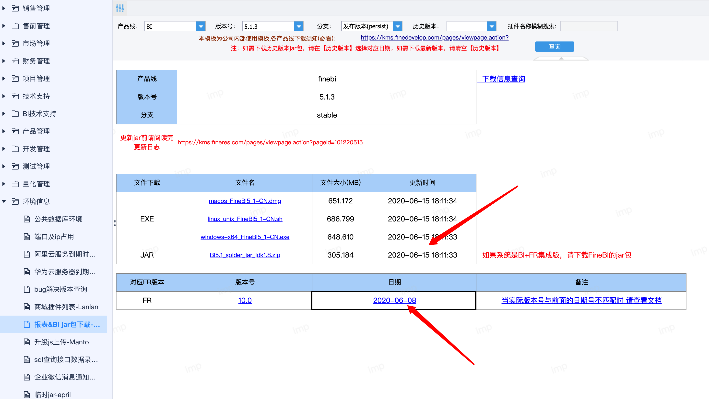

# FineBI 插件开发工程

完全傻瓜化的配置，开箱即用。

## 安装gradle
用于构建开发工程和插件包，gradle安装文档参考：https://wiki.jikexueyuan.com/project/gradle-2-user-guide/installing.html

## 配置开发工程
直接使用IntelliJ IDEA打开这个目录即可。

如果需要复制jar包到webroot/WEB-INF/lib下，可以执行命令：```gradle install```

**注意：**该工程依赖的jar为私有maven服务器，地址在build.gradle的repositories中定义。

## 复制插件配置

* 将plugin.xml文件复制到webroot/WEB-INF/plugins/plugin-xyz-1.0目录下，其中xyz一般用插件id表示。
* 在开发工具内部，手动编译插件class文件到插件目录

## 启动FineBI服务器
如果希望正常的进行插件开发，使用```com.finebi.start.Learner```启动FineBI服务器。


## 插件示例展示

[箱线图示例](plugin-demo/readme.md)

## 构建插件包
执行命令：```gradle zip```即可构建插件包，插件包位置位于插件目录/build/install下。

## 增加新的插件
将插件源码目录放到根目录下，同时修改settings.gradle文件，再刷新gradle配置即可。

## 修改依赖的jar版本
只需要更改build.gradle中的fineVersion和finebiVersion变量即可。

版本查看：CRM-环境信息-报表&BI jar包下载


Maven仓库确认[版本jar包](http://mvn.finedevelop.com/#browse/browse:fanruan-release)
fineVersion=10.0.2020.06.08
finebiVersion=5.1.2020.06.15

## 新增插件项目

参考报表插件开发教程之[新增插件项目](http://dev.fanruan.com:8090/pages/viewpage.action?pageId=25756453)
